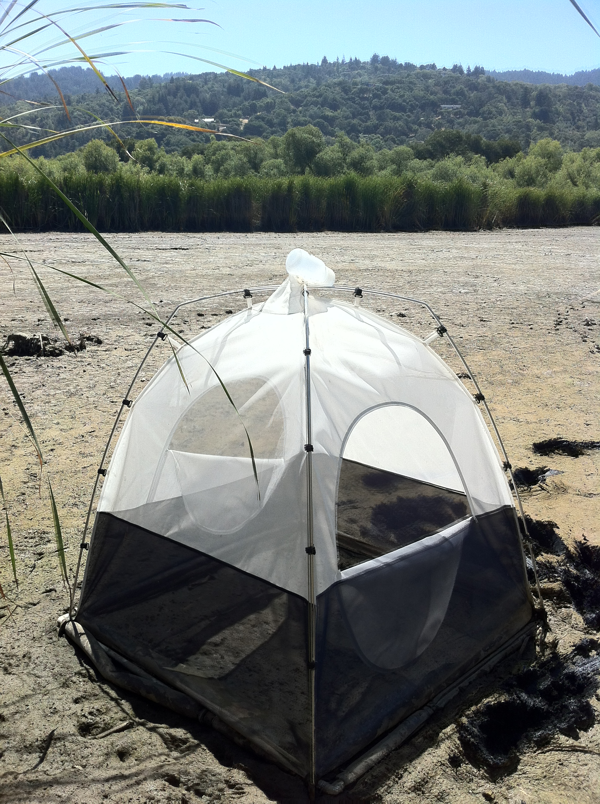
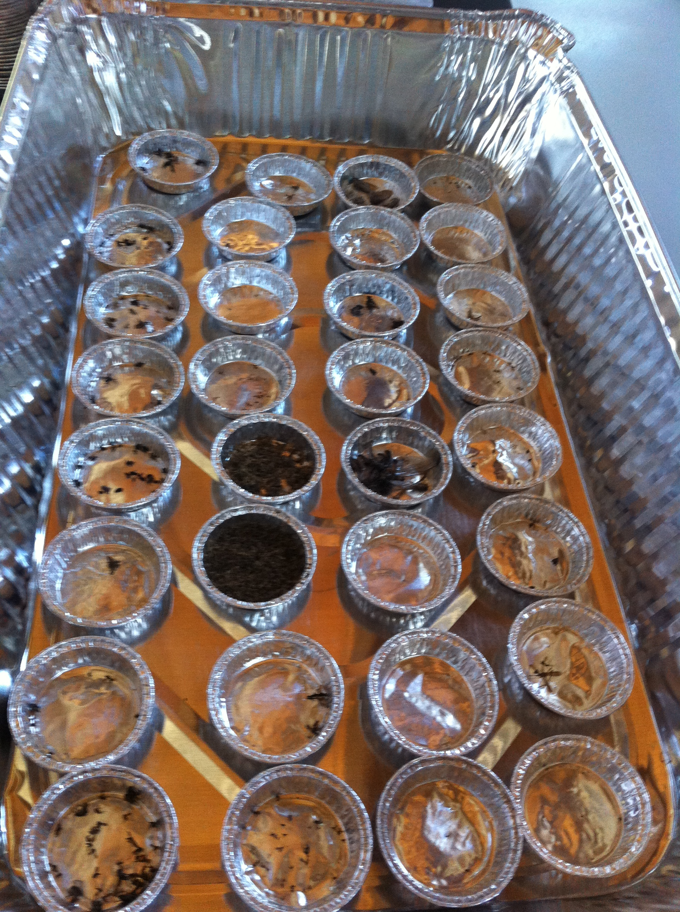
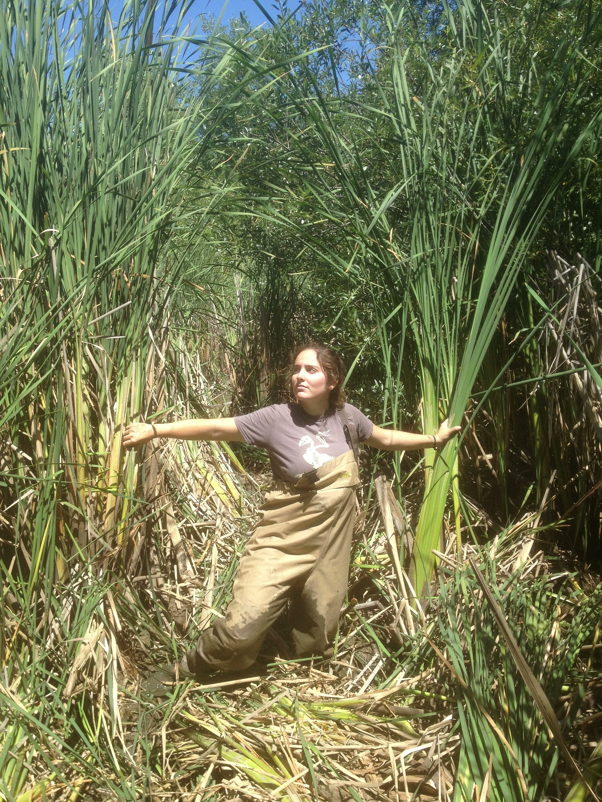

Data used for this project was collected in 2012 and 2013 under David Moreno-Mateos at Jasper Ridge Biological Preserve (Stanford University), and all data was used with permission. GIS Shapefiles and weather data prior to April 2013 were provided by JRBP for expressed use in this project. Weather data from April 2013 and beyond was taken from Weather Underground weather station at JRBP, available online. 

Previous analyses of these data included examining insect flux across terrestrial and wetland habitats (1, 2, 3). Insects were captured in malaise traps, which are tent like structures that capture flying insects. The insects hit the trap and crawl upwards to escape, only to fall into bottles (full of soapy water) to be collected (lucky us). These bottles containing insects were then taken back to the lab where bugs were strained out, identified to order, infraorder or family (as low as we could ID), dried in an oven, and ground into dust for isotopic analysis. 






This data analysis and visualization only takes into account relative abundances, but introduces new data regarding weather and vegetation near trap sites. The goal of this project is to visualize any potential differences in abundances around the different habitats in the preserve. Over the course of the project, traps were located at 5 sites throughout the preserve, Middle Marsh (M), San Francisquito Creek (R), Skipper's Pond (S),  the west bank of Searsville Lake (L), and the east bank (opposite side) of Searsville Lake (O). Middle Marsh is the east-most set of traps, with 6 individual traps at two points (M1,M2,M3 & M3,M4,M5). San Francisquito is the northern-most site, with three traps (R1, R2, R3). Skipper's Pond (S1, S2, S3) is the southern-most site. Finally, The east bank of Searsville (O) also had three traps (O1, O2, O3).

First, I plotted GIS shapefiles with information on vegetation on top of a satellite google image of Jasper Ridge for context. The vegetation types that are important to take note of are Bog and Marsh, Riparian and Bottomland Habitat, and Broad Leafed Upland Tree Dominated landscapes. These are the vegetation types that surround each trap. For marsh traps, we expected high abundances of insects as there is ample vegetation and shallow water to breed in. We predicted lake traps to have lower abundances of insects, as the open water allows for more consumption by predators (like Dragonfly larvae that emerge from the water). Leaving the lake habitats could be an indication of predator avoidance. The riparian habitat that surrounds the creek, and Skipper's pond are both smaller water bodies that would be suitible for insects, but perhaps not attract as many as the Marsh. 

When insect counts per trap by family are superimposed on the trap locations, it is easy to see that for most families of insects, they are heavily abundant in the marsh habitats and less so in the lake habitats. 

For certain families and orders however, this is not true. One striking example is Lepidoptera (O. Lepidoptera, oversize moths). During breeding season, there are huge numbers of these moths that breed near oak trees. For this reason, they are found primarily in locations where there are large numbers of oak trees. This favored traps that were placed as terrestrial controls (M1, O1, S1, R1, L1) rather than traps closer to the water.

In addition, insect abundances peak during the summer for the breeding season. This is heavily correlated with temperature, which we can see in the two plots for temperature and insect abundance over time. 

We can see then, that there are patterns that can be analyzed by family and other groups that may tell us more about how insects interact with their environment. This analysis is useful as it allows us examine relationships between wetland ecosystems and the invertebrates that live there, and ultimately will serve to help us better understand ecosystem function.





References:
1) David Moreno-Mateos, http://www.ncbi.nlm.nih.gov/pmc/articles/PMC3265451/
2) http://academic.reed.edu/es/messef.html
3) http://academic.reed.edu/es/assets/images/Fox_2013_MESSE.jpg


```{r, echo=FALSE, warning=FALSE, message=FALSE}
suppressPackageStartupMessages(library(shiny))
suppressPackageStartupMessages(library(dplyr))
suppressPackageStartupMessages(library(rgdal))
suppressPackageStartupMessages(library(ggplot2))
suppressPackageStartupMessages(library(stringr))
suppressPackageStartupMessages(library(rvest))
suppressPackageStartupMessages(library(tidyr))
suppressPackageStartupMessages(library(maps))
suppressPackageStartupMessages(library(ggmap))
suppressPackageStartupMessages(library(lubridate))
suppressPackageStartupMessages(library(RColorBrewer))
suppressPackageStartupMessages(require(gridExtra))

#Insect Counts and Timeseries
insectcount<- read.csv("./Data/insectcounts_na.csv", header=TRUE) %>%
              tbl_df() %>% 
              gather(family,n, 5:68) %>%
              mutate(date=mdy(date)) %>%
              transmute(date, bottle.name, location, trap.name, family, n)

#Timeseries- Weather
weather1<- read.csv("./Data/weatherdata.txt") %>% tbl_df() %>%
           mutate(date= ymd(Date))%>% 
          select(date, TemperatureAvgF)

weather <- read.csv("./Data/insect_weather.csv") %>% tbl_df %>%
            unite(Date, year,dayofyear, sep = "-") %>%
            transmute(date=parse_date_time(Date, "%y%j"),TemperatureAvgF=TemperatureAvgF) %>%
            bind_rows(weather1)
          

#Combining Insects with Trap Locations.
traplocations <- read.csv("./Data/traplocations.csv",header=TRUE) %>%
                 tbl_df()
locationcoord <- read.csv("./Data/locationzoom.csv", header=TRUE) %>%
                 tbl_df()

insects <- insectcount %>% 
                group_by(date, trap.name, family) %>%
                summarise(count=sum(n))
insectloc <- inner_join(insects, traplocations, by="trap.name") %>%
                tbl_df() 


# for total abundance timeseries
insectsum <- insectcount %>% 
             group_by(date, family) %>%
             summarise(count=sum(n))
     
#Extracting data and creating data for plotting
##Trails

jr.trailsfile <- readOGR(dsn="./Data/JR_TRAILS", layer="JR_TRAILS", verbose=FALSE) %>%
                 spTransform(CRS("+proj=longlat +ellps=WGS84")) 

trails.map <- fortify(jr.trailsfile)
trail.data <-jr.trailsfile@data %>% tbl_df()

##Vegetation
jr.vegfile <- readOGR(dsn="./Data/JRVEG_SHAPEFILE", layer="JR_vegetation_2012", 
              verbose=FALSE) %>%
              spTransform(CRS("+proj=longlat +ellps=WGS84")) 

jr.vegfile@data$id = rownames(jr.vegfile@data)

veg.map <- fortify(jr.vegfile, region="id") %>% tbl_df()
veg.df <- inner_join(veg.map, jr.vegfile@data, by="id") %>%
          filter(CNDDB1 %in% c("Bog and Marsh", "Broad Leafed Upland Tree Dominated", "Coniferous Upland Forest and Woodland", "Grass and Herb Dominated Communities", "Riparian and Bottomland Habitat", "Scrub and Chaparral")) %>%
          rename(Vegetation=CNDDB1)

#Overall Map
#google map access
google.map <-
  get_map(location = "Searsville Lake, San Mateo County, CA", maptype = "hybrid", zoom = 15, color = "color")


```

```{r, echo=FALSE, warning=FALSE, message=FALSE}
inputPanel(
  dateRangeInput("daterange", "Date range:",
               start = "2012-05-30",
               end   = "2013-07-10",
               format = "MM-dd-yy",
               min = "2012-05-30",
               max = "2013-07-10"
               ),
  
  selectInput("family", label = "Insect Family",
               choices = c("total.count", "s.acalyptrata", "acalyptrata", "s.calyptrata", "calyptrata", "auchenorrhynca", "o.auchenorrhyncha", "polyphaga", "o.polyphaga", 
"s.apocrita", "apocrita", "o.apocrita", "p.apocrita", "formicidae", 
"vespidae", "anthrophila", "chironomidae", "o.chironomidae", 
"sciaridae", "mycetophilidae", "o.mycetophilidae", "cecydomidae", 
"empidoidea", "o.empidoidea", "platypezidae", "phoroidea", "o.phoroi", 
"sternorrhyca", "o.sternorrhyncha", "psocoptera", "odonata", 
"syrphoidia", "o.syrphoidea", "s.lepidoptera", "lepidoptera", 
"o.lepidoptera", "lepidoptera.2", "psychodomorpha", "neuroptera", 
"tipulomorpha", "o.tipulomorpha", "heteroptera", "o.heterop", 
"tingidae", "plannipenia", "o.plannipenia", "tricoptera", "o.tricoptera", 
"symphyta", "ceratopogonidae", "xylophagomorpha", "tabanomorpha", 
"thysanoptera", "scathophagidae", "ephemeridae", "asilidae", 
"culicidae", "isoptera", "simuliidae", "lonchopteridae", "plecoptera", 
"rophidoptera", "dolichopodidae"), selected = "total.count", multiple= TRUE
  ),

submitButton("Submit")
)

output$plot<-renderPlot({
      # Inputs and Variables.    
      startdate <- input$daterange[1]
      enddate <- input$daterange[2]
      date.range <- interval(startdate, enddate)
      
      familynames <- input$family
   
      insectgraph <- filter(insectloc, family %in% familynames ) %>%
                     filter(date %within% date.range)
      
      insecttime <- filter(insectsum, family %in% familynames) %>%
                    filter(date %within% date.range)
      
      weather <- filter(weather, date %within% date.range)
 
      
# Make map.  
map <-  ggmap(google.map)+
        geom_polygon(data=veg.df, 
                     aes(x=long, y=lat, group=group, fill=Vegetation),alpha=0.2) +
        geom_path(data=trails.map, 
                     aes(x=long, y=lat, group=group),col="black", size=0.2) +
        geom_point(data=insectgraph, 
                     aes(x=long, y=lat, size=count, color=family), alpha=0.5)+
        scale_color_brewer(palette="Set1")+
        scale_size_continuous(range = c(1, 18))+
        coord_map() +
        xlab("Longitude") + ylab("Latitude")+
        theme_bw()
  
#Timeseries
i.timeseries <- ggplot(insecttime, aes(x=date, y=count, col= family))+
                geom_line()+
                scale_color_brewer(palette="Set1")+
                xlab("Date") + ylab("Insect Abundance (Count)")+
                ggtitle(paste(paste("Insect Abundance from", startdate, "to", enddate))) +
                theme_minimal()+
                theme(legend.position = "none")

w.timeseries <- ggplot(weather, aes(x=date, y=TemperatureAvgF)) +
                geom_line() +
                xlab("Date") + ylab("Avg. Temperature in F˚")+
                ggtitle(paste(paste("Average Temperature from", startdate, "to", enddate)))+
                theme_minimal()


               grid.newpage() 
      pushViewport(viewport(layout = grid.layout(9, 1)))
      print(map, vp = viewport(layout.pos.row = 1:5, layout.pos.col = 1))
      print(i.timeseries, vp = viewport(layout.pos.row = 6:7, layout.pos.col = 1)) 
      print(w.timeseries, vp = viewport(layout.pos.row = 8:9, layout.pos.col = 1)) 
      
    }, height = 800, width = 800 )


output$table <- renderDataTable({
                              startdate <- input$daterange[1]
                              enddate <- input$daterange[2]
                              date.range <- interval(startdate, enddate)
                              familynames <- input$family
                              insectgraph <- filter(insectloc, family %in% familynames ) %>%
                                filter(date %within% date.range)
                              insecttime <- filter(insectsum, family %in% familynames) %>%
                                filter(date %within% date.range)
                              
                              weather <- filter(weather, date %within% date.range)
                               insecttime})

mainPanel(
    tabsetPanel(
      tabPanel('graphs', plotOutput("plot", height="auto") ),
      tabPanel('table',
               dataTableOutput("table"))) )


      

    

```
